# F1 App

Flutter app with Formula 1 stats  
(standings, results, calendar, predictor, circuits, profile).

Data:
- [Jolpica F1 API](https://github.com/jolpica/jolpica-f1) (Ergast-compatible) — schedule, results, standings
- [ESPN](https://site.api.espn.com/) — news (on Home), weekend scoreboard, driver photos

Same idea, other stacks:

- [f1_kotlin](https://github.com/DaniilPavlov/f1_kotlin) — Kotlin + Jetpack Compose (Android)
- [f1_kmp](https://github.com/DaniilPavlov/f1_kmp) — Kotlin Multiplatform (Android / iOS)

## Screenshots

<p>
  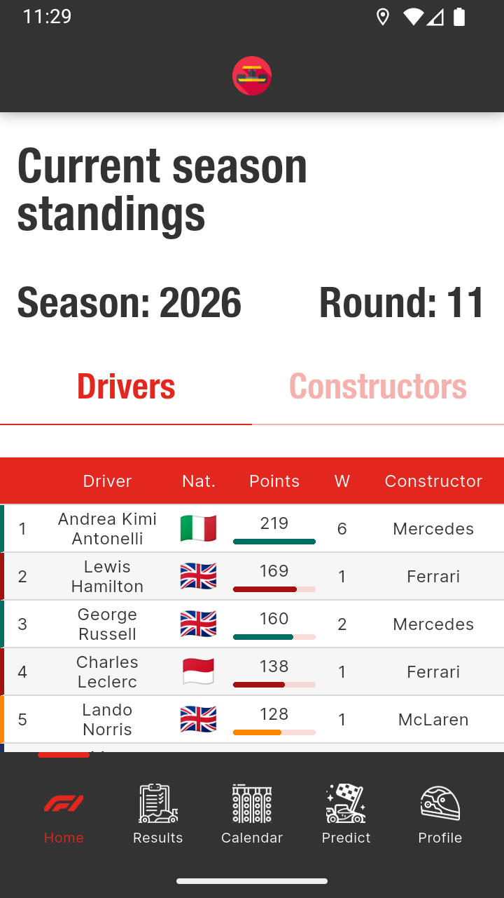
  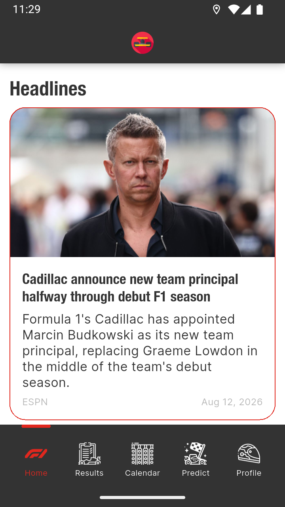
  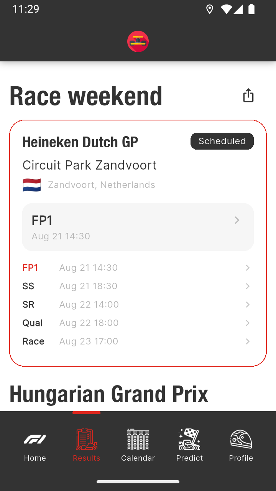
  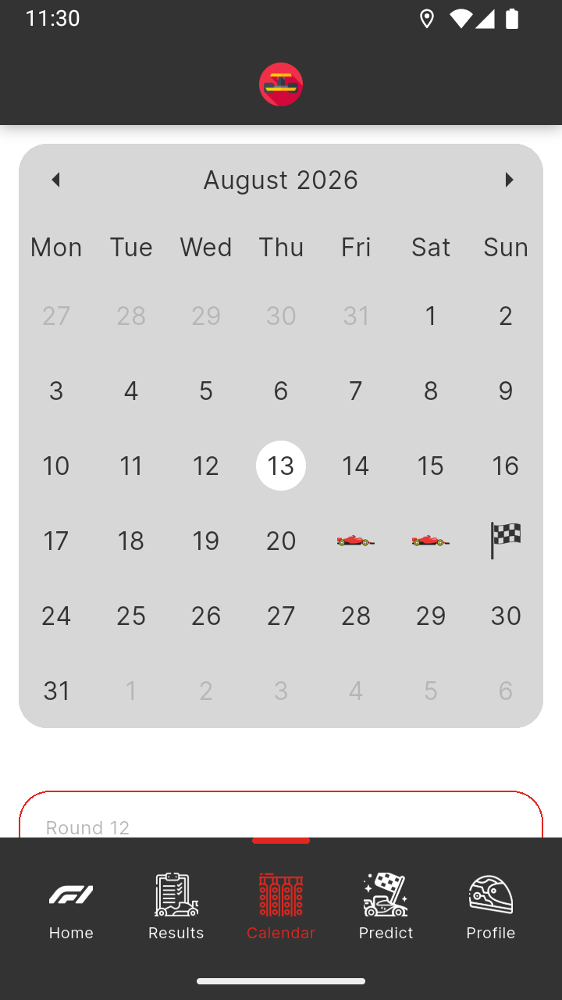
  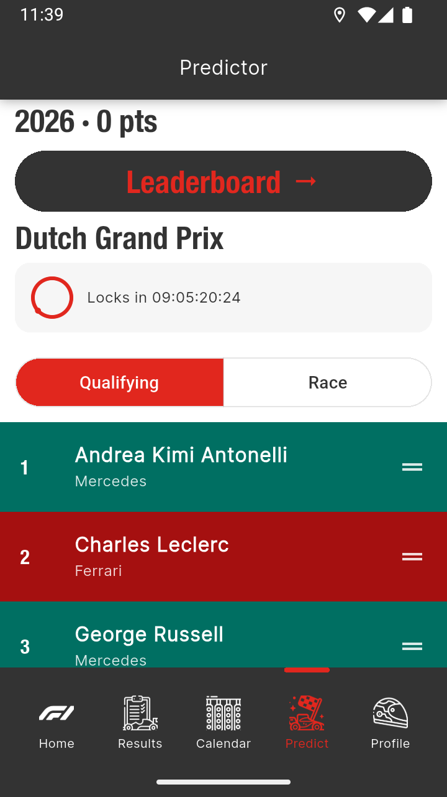
  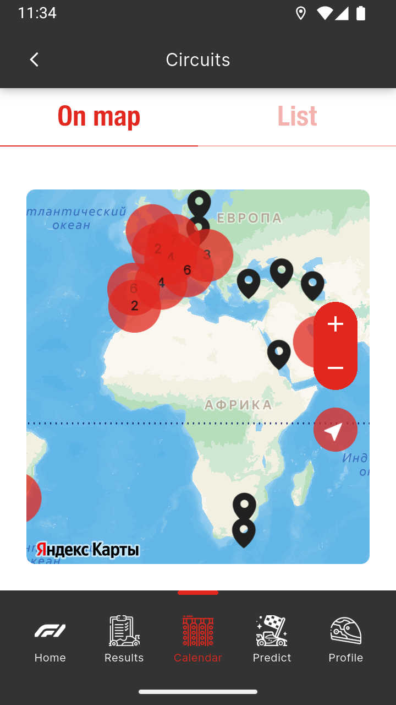
  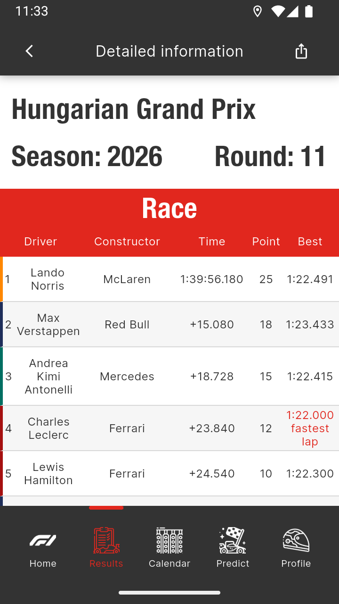
  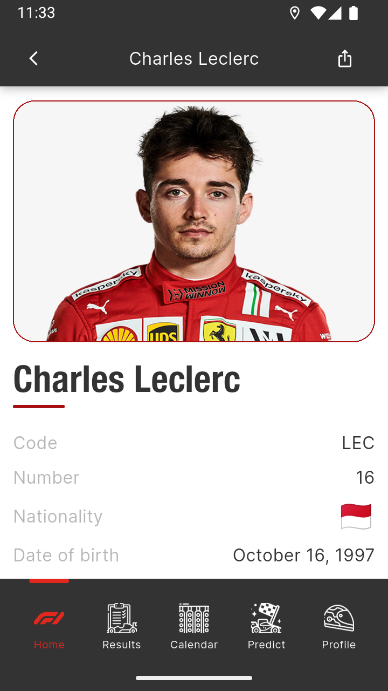
  
  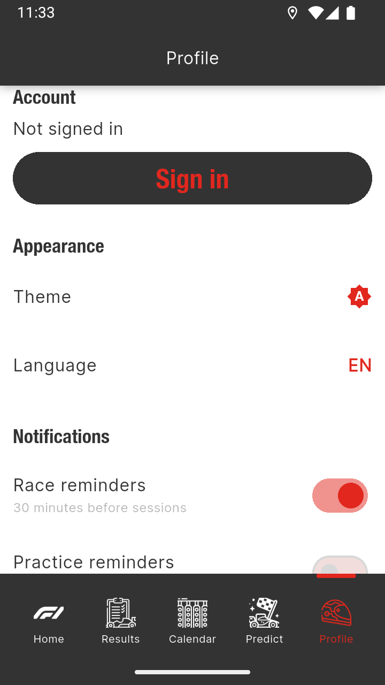
  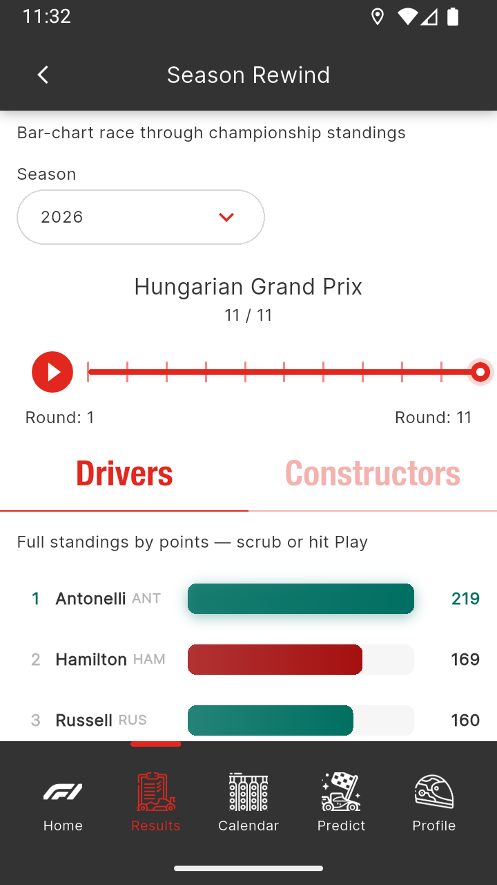
  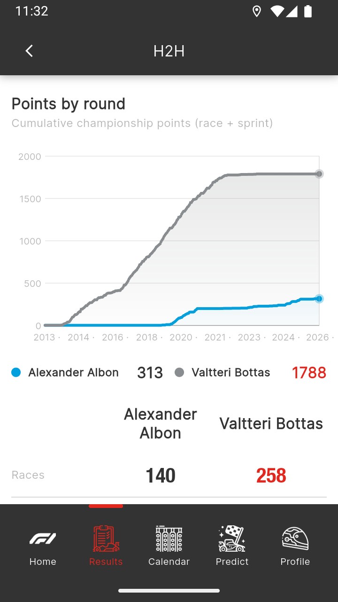
</p>

## Stack

| Layer | Tech |
|------|------------|
| UI | Flutter, Material 3, light/dark themes |
| State | MobX + Provider |
| Navigation | Auto Route + `app_links` deep links |
| Network | Dio (`AppDio`, Jolpica `RequestHandler`) |
| Data | Feature repositories + `AppDataRefresh` (pull-to-refresh) |
| Native / FFI | `dart:ffi` + C zlib (`native/cache_zlib`) for Jolpica disk-cache compression |
| Codegen | json_serializable, mobx_codegen, auto_route_generator, envied |
| Map | Yandex MapKit |
| Backend | Firebase (Core, Auth, App Check, Firestore, Analytics, Crashlytics, Remote Config), AppMetrica |
| Tests | unit + widget/golden (`test/units/`, `test/widget/`, shared `test/helpers/`) |

## Architecture

- **DI** — root `MultiProvider` in `lib/main.dart` (repos, `AppDataRefresh`, reminders). ESPN `Dio` is created in `main` and passed into repos.
- **Jolpica** — one `RequestHandler` wired via `ApiLoader.configure` (static access from repos); screens do not call Dio.
- **Repositories** — Jolpica/ESPN/Wikipedia live in `*/repositories/`.
- **`AppDataRefresh.clearAll()`** — soft-invalidate on pull-to-refresh; cached data kept for offline.
- **Cache** — Jolpica: `CacheInterceptor` (memory + prefs). Disk payloads compressed via **Dart FFI → native zlib** (`native/cache_zlib`, see [Native zlib (FFI)](#native-zlib-ffi)). ESPN/schedule/seasons: `PrefsJsonStore` / `DayPrefsJsonStore`.
- **Theme** — `ThemeController` + `AppThemeData` / `AppColors` (light & dark).
- **Analytics** — typed `AnalyticsEvent` + `AnalyticsGateway` (Firebase + AppMetrica); route observer for screens.
- **Deep links** — `F1PetDeepLinkHandler` (`f1pet://driver|constructor|circuit/<id>`, `f1pet://race/live`).
- **Home widgets (Android)** — standings top-3 + next GP countdown; synced via method channel.
- **Firebase** — `bootstrapFirebase()` in `main`. Client configs **gitignored**; CI uses `tool/ci` stubs.
- **AppMetrica** — `bootstrapAppMetrica()` from `.env` (envied).
- **Logging** — package `logger` + Talker / Dio logger in debug (`lib/common/debug_tools/`; eye FAB → inspector + Talker).
- **iOS deps** — Swift Package Manager (CocoaPods removed). MapKit variant: `ios/YandexMapkit.variant` (`full` / `lite`).

## Native zlib (FFI)

Jolpica GET responses are cached in SharedPreferences. JSON repeats a lot of keys, so disk entries are compressed with a thin **C zlib** wrapper called from Dart through **`dart:ffi`** (not MethodChannel, not `dart:io` gzip).

| Piece | Role |
|-------|------|
| `native/cache_zlib/` | C API: `cache_zlib_compress` / `decompress` / `free` (malloc ownership on the native side) |
| Android | CMake → `libf1_cache_zlib.so` (`android/app` `externalNativeBuild`) |
| iOS | `cache_zlib.c` linked into Runner + `libz`; `-Wl,-u,_cache_zlib_*` keeps symbols from dead-strip |
| `lib/services/cache/zlib/` | Hand-written FFI bindings, library loader, envelope codec |
| `CachePayloadCodec` | Interceptor hook; FFI when the native lib loads, else plain JSON (web / missing dylib) |

**Wire format in prefs:** `z1:` + base64(`uint32_be uncompressed_len` ‖ zlib bytes). Values without the prefix are treated as legacy uncompressed JSON (still readable).

**Why FFI here:** real offline cache size win; shows `DynamicLibrary` (`.so` vs `process()`), `Pointer`/`Arena` lifecycle, and ABI ownership (`cache_zlib_free`) on a path the app already owns.

Host dylib for the FFI unit test (optional; test skips if missing):

```bash
# cmake, or clang if cmake is not installed:
clang -shared -fPIC -O2 -I native/cache_zlib/include \
  native/cache_zlib/src/cache_zlib.c -lz \
  -o build/cache_zlib/libf1_cache_zlib.dylib

F1_CACHE_ZLIB_LIB="$PWD/build/cache_zlib/libf1_cache_zlib.dylib" \
  flutter test test/units/services/cache/
```

## Structure

```
f1_pet_project/
├── lib/
│   ├── common/
│   ├── core/        # home, results, schedule, news, circuits
│   ├── data/
│   ├── services/    # analytics, cache (+ zlib FFI), deeplinks, firebase, home_widget, …
│   ├── app_config.dart
│   └── router/
├── native/
│   └── cache_zlib/  # C zlib wrapper for Dart FFI
├── tool/ci/
├── assets/
│   ├── fonts/       # HelveticaNeueCyr-Bold, Inter-Regular
│   ├── circuits/ …
│   └── …
├── test/
│   ├── helpers/     # fixtures, fakes, pumpApp / screen smoke
│   ├── units/       # mirrors lib/ (common, core, services)
│   └── widget/      # common, home, results, schedule, circuits, screens, misc + goldens/
├── android/ / ios/  # iOS: SPM (no Podfile)
└── .github/workflows/
```

## Requirements

- Flutter **3.38.5** (CI pinned), Dart **≥3.10**, Java **21** (Android release)
- Yandex MapKit API key, Firebase project

## Secrets

Not in git. Local `.env`:

```bash
APPMETRICA_API_KEY=...
YANDEX_MAPKIT_API_KEY=...
```

```bash
dart run build_runner build --force-jit
flutter run
```

iOS MapKit: `ios/Flutter/Secrets.xcconfig` with `YANDEX_MAPKIT_API_KEY=...` (gitignored).  
Firebase files from FlutterFire are gitignored; CI uses stubs.

## Firebase

```bash
firebase login
flutterfire configure --yes --project=<PROJECT_ID> --platforms=android,ios,web
```

Remote Config: `min_app_version` (string).

## CI / CD

[](https://github.com/DaniilPavlov/f1_pet_project/actions/workflows/ci.yml)

| Workflow | When | What |
|----------|------|------|
| `ci.yml` | push / PR → `master` | analyze, test, coverage gate (≥80%, excl. generated/l10n) |
| `release.yml` | tag `v*` | APK + GitHub Release |

```bash
flutter test --coverage
dart run tool/ci/check_coverage.dart --min 80 --path coverage/lcov.info
```

```bash
# bump pubspec `version: name+code` (code must increase), then:
git tag v1.6.3 && git push origin v1.6.3
```

Release secrets: `YANDEX_MAPKIT_API_KEY`, `ANDROID_KEYSTORE_*` (required); `APPMETRICA_API_KEY`, `FIREBASE_OPTIONS_DART`, `GOOGLE_SERVICES_JSON` (optional).

```bash
keytool -genkey -v -keystore upload-keystore.jks -keyalg RSA -keysize 2048 -validity 10000 -alias upload
base64 -i upload-keystore.jks | pbcopy   # → ANDROID_KEYSTORE_BASE64
```

## Web / tests

```bash
flutter build web --release
flutter analyze && flutter test
```

Optional FFI host lib for `test/units/services/cache/zlib/` (see [Native zlib (FFI)](#native-zlib-ffi)).

## Deep links

```text
f1pet://driver/<driverId>
f1pet://constructor/<constructorId>
f1pet://circuit/<circuitId>
f1pet://race/live
f1pet://race/<season>/<round>   # reminder tap → Results if that weekend is live, else Schedule
```

## Features

- **Home** — current season driver and constructor standings; ESPN headlines
- **Results** — weekend scoreboard (live polling), latest race, race search, hall of fame, season rewind (animated racing-bar standings by round), H2H (drivers / constructors) with points-by-round chart, finish statuses
- **Live race mode** — app-wide session banner while ESPN status is live; deep link `f1pet://race/live` → Results
- **Calendar** — monthly calendar with session times; on empty days shows next GP card (layout + countdown); local reminders 30 min before; circuits list/map
- **Predictor** — race/quali grid predictions (auth + verified email); season history and scoring
- **Profile** — account (email/password), theme, locale, race reminder prefs
- **Circuits** — list and map with pins/clusters, track layouts, length/laps/turns/speed/elevation, Wikipedia, winners history
- **Driver / Constructor cards** — ESPN photos, career stats with tappable wins / podiums / poles lists, share as image
- **Android home widgets** — top-3 standings + next GP countdown
- **Themes** — system / light / dark
- **A11y** — semantics on standings and race tables
- **Localization** — Russian and English
